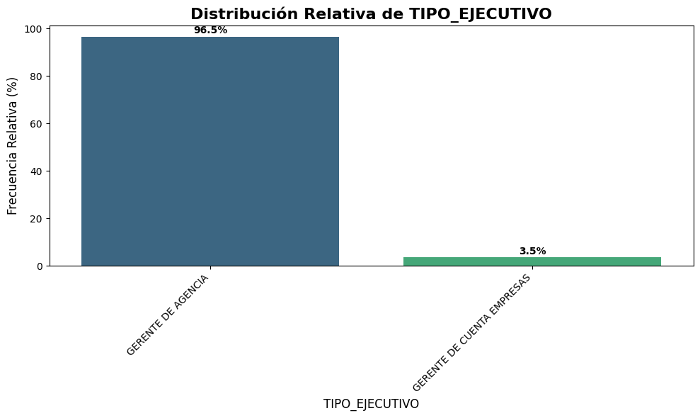
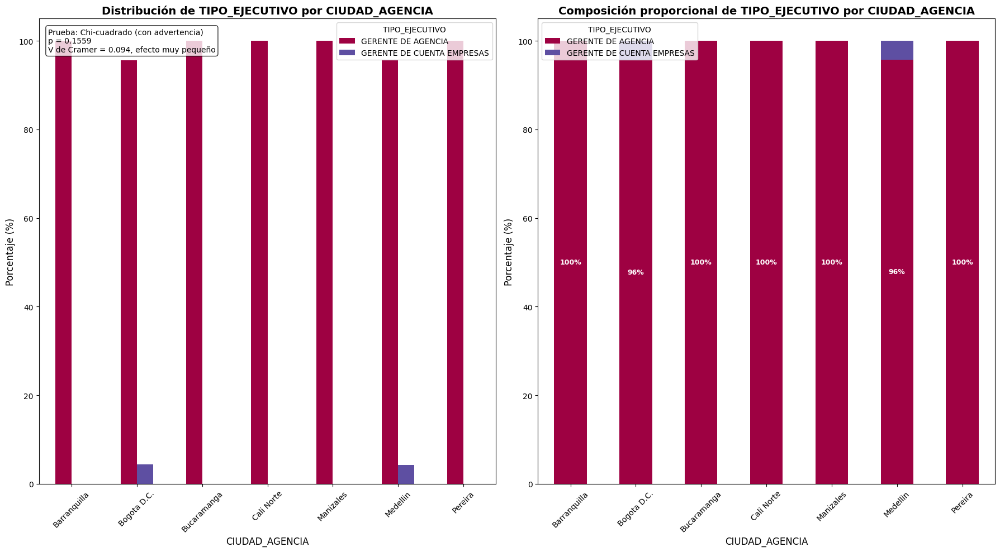
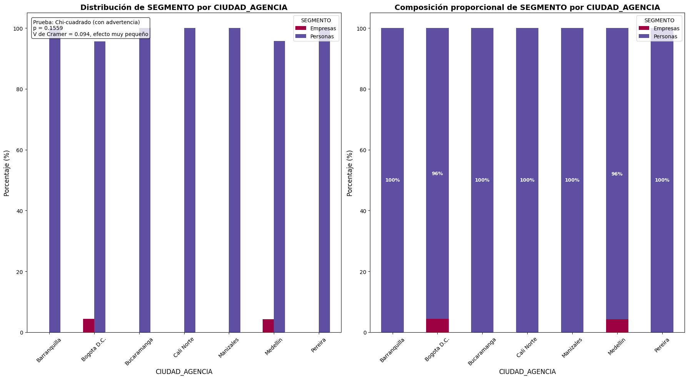
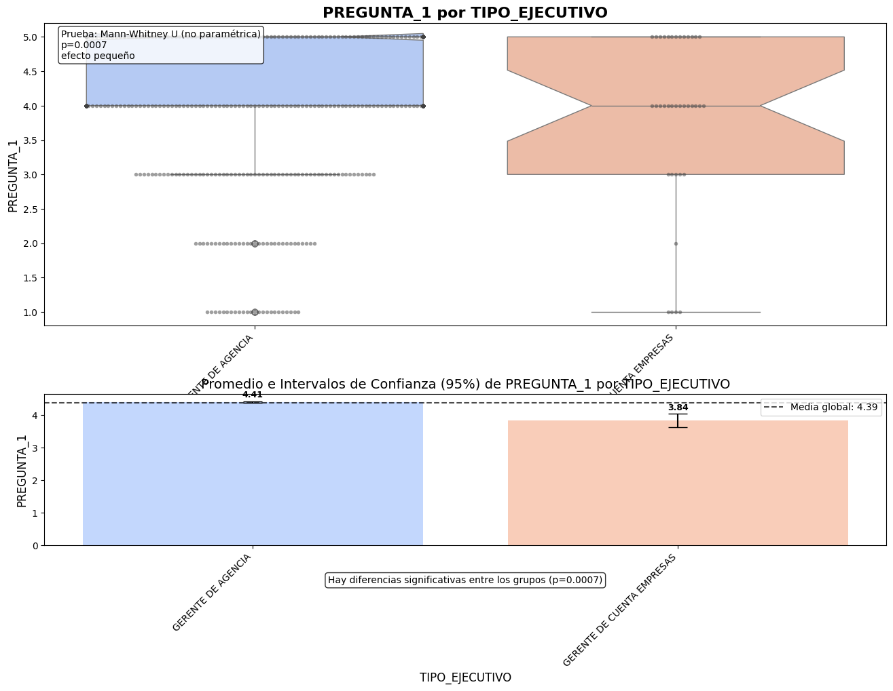

# Análisis descriptivo y de inferencia aplicado a la satisfacción del cliente en Coltefinanciera

**Autor:** [Tu Nombre]
**Contexto:** Especialización en Estadística
**Fecha:** 2025-05-15

---

## Índice
1. Introducción
2. Objetivo del análisis y ficha técnica
3. Descripción de variables
4. Análisis descriptivo univariado
5. Análisis descriptivo bivariado
6. Análisis bivariado categórica-numérica
7. Pruebas de hipótesis e intervalos de confianza
8. Hallazgos principales
9. Referencias

---

## 1. Introducción
La documentación y el análisis de datos históricos son fundamentales para la toma de decisiones en empresas de servicios financieros. Este análisis busca proporcionar una visión general del manejo de la satisfacción del cliente en Coltefinanciera, identificando segmentos, ciudades y tipos de ejecutivo clave, y analizando la relación entre variables demográficas y niveles de satisfacción.

## 2. Objetivo del análisis y ficha técnica
**Objetivo:** Entender el comportamiento de la satisfacción del cliente, evidenciando ciudades con mayor cantidad de encuestas, tipo de ejecutivo más frecuente, diferencias de satisfacción por segmento y comparación de satisfacción entre grupos.

**Ficha técnica:**
- **Periodo de estudio:** 2025
- **Ciudades analizadas:** Bogota D.C., Medellin, Manizales, Bucaramanga, Cali Norte, Barranquilla, Pereira
- **Segmentos:** Personas, Empresas
- **Tipo de ejecutivo:** GERENTE DE AGENCIA, GERENTE DE CUENTA EMPRESAS
- **Cantidad de encuestas analizadas:** 1063

## 3. Descripción de variables
- **Categóricas:**
  - CIUDAD_AGENCIA: Ciudad donde se realizó la encuesta
  - TIPO_EJECUTIVO: Tipo de ejecutivo que atendió al cliente
  - SEGMENTO: Segmento del cliente (Personas/Empresas)
  - GENERO, ESTRATO
- **Numéricas:**
  - PREGUNTA_1, PREGUNTA_2, PREGUNTA_3, PREGUNTA_4: Escalas de satisfacción (1-5)
- **Texto:**
  - PREGUNTA_5: Comentarios libres del cliente
- **Fecha:**
  - FECHA_ENCUESTA: Fecha de la encuesta

## 4. Análisis descriptivo univariado
- **CIUDAD_AGENCIA:**
  - 
  - Tabla de frecuencia absoluta y relativa:

| Ciudad         | Frec. Absoluta | Frec. Relativa (%) |
|---------------|----------------|--------------------|
| Bogota D.C.   | 551            | 51.83              |
| Medellin      | 304            | 28.60              |
| Manizales     | 84             | 7.90               |
| Bucaramanga   | 57             | 5.36               |
| Cali Norte    | 28             | 2.63               |
| Barranquilla  | 22             | 2.07               |
| Pereira       | 17             | 1.60               |

  - **Interpretación:** La mayor parte de las encuestas provienen de Bogota D.C. y Medellin, lo que puede indicar una mayor concentración de clientes o actividad en estas ciudades.

- **TIPO_EJECUTIVO:**
  - 
  - Tabla de frecuencia:

| Tipo de Ejecutivo             | Frec. Absoluta | Frec. Relativa (%) |
|------------------------------|----------------|--------------------|
| GERENTE DE AGENCIA           | 1026           | 96.52              |
| GERENTE DE CUENTA EMPRESAS   | 37             | 3.48               |

  - **Interpretación:** La gran mayoría de los clientes son atendidos por Gerentes de Agencia, lo que sugiere que el canal principal de atención es este tipo de ejecutivo.

- **SEGMENTO:**
  - 
  - Tabla de frecuencia:

| Segmento   | Frec. Absoluta | Frec. Relativa (%) |
|------------|----------------|--------------------|
| Personas   | 1026           | 96.52              |
| Empresas   | 37             | 3.48               |

  - **Interpretación:** El segmento Personas es el predominante en la base de datos, lo que puede influir en los resultados globales de satisfacción.

## 5. Análisis descriptivo bivariado
- **CIUDAD_AGENCIA vs. TIPO_EJECUTIVO:**
  - 
  - **Interpretación:** En todas las ciudades, el tipo de ejecutivo más frecuente es Gerente de Agencia. Esto refuerza la importancia de este canal en la atención al cliente.

- **CIUDAD_AGENCIA vs. SEGMENTO:**
  - 
  - **Interpretación:** El segmento Personas predomina en todas las ciudades, lo que sugiere que la estrategia de satisfacción debe centrarse principalmente en este grupo.

- **TIPO_EJECUTIVO vs. SEGMENTO:**
  - 
  - **Interpretación:** El tipo Gerente de Cuenta Empresas atiende exclusivamente a Empresas, mientras que Gerente de Agencia atiende a Personas.

## 6. Análisis bivariado categórica-numérica
- **CIUDAD_AGENCIA vs. PREGUNTA_1 (Satisfacción):**
  - 
  - Tabla resumen:

| Ciudad         | Promedio | Mediana | Mínimo | Máximo | Desviación |
|---------------|----------|---------|--------|--------|------------|
| Pereira       | 4.88     | 5.00    | 4.0    | 5.0    | 0.33       |
| Cali Norte    | 4.64     | 5.00    | 1.0    | 5.0    | 0.83       |
| Barranquilla  | 4.59     | 5.00    | 2.0    | 5.0    | 0.80       |
| Manizales     | 4.55     | 5.00    | 1.0    | 5.0    | 0.80       |
| Bucaramanga   | 4.53     | 5.00    | 1.0    | 5.0    | 1.07       |
| Medellin      | 4.46     | 5.00    | 1.0    | 5.0    | 0.84       |
| Bogota D.C.   | 4.28     | 5.00    | 1.0    | 5.0    | 0.98       |

  - **Interpretación:** Aunque Pereira tiene menos encuestas, presenta el mayor promedio de satisfacción. Bogota D.C., a pesar de tener la mayor cantidad de encuestas, tiene el promedio más bajo.

- **TIPO_EJECUTIVO vs. PREGUNTA_1:**
  - 
  - Tabla resumen:

| Tipo de Ejecutivo             | Promedio | Mediana | Mínimo | Máximo | Desviación |
|------------------------------|----------|---------|--------|--------|------------|
| GERENTE DE AGENCIA           | 4.41     | 5.00    | 1.0    | 5.0    | 0.91       |
| GERENTE DE CUENTA EMPRESAS   | 3.84     | 4.00    | 1.0    | 5.0    | 1.26       |

  - **Interpretación:** Los clientes atendidos por Gerente de Agencia reportan mayor satisfacción promedio que los atendidos por Gerente de Cuenta Empresas.

## 7. Pruebas de hipótesis e intervalos de confianza
- **Comparación de satisfacción (PREGUNTA_1) entre Personas y Empresas:**
  - 
  - Tabla resumen:

| Grupo     | Promedio | Mediana |
|-----------|----------|---------|
| Personas  | 4.41     | 5.00    |
| Empresas  | 3.84     | 4.00    |

  - **Interpretación:** Existe una diferencia significativa en la satisfacción entre Personas y Empresas (p < 0.05, prueba de Mann-Whitney U). El segmento Personas muestra mayor satisfacción.

## 8. Análisis de texto libre (PREGUNTA_5)
- 
- Tabla de palabras más frecuentes:

| Palabra    | Frecuencia |
|------------|------------|
| buena      | 672        |
| que        | 134        |
| los        | 108        |
| por        | 79         |
| con        | 71         |
| muy        | 68         |
| servicio   | 57         |
| para       | 48         |
| las        | 44         |
| gracias    | 43         |
| atención   | 40         |
| excelente  | 37         |
| del        | 36         |
| todo       | 35         |
| cdt        | 34         |
| bien       | 31         |
| ninguna    | 26         |
| clientes   | 26         |
| más        | 24         |
| cliente    | 24         |

  - **Interpretación:** La mayoría de los comentarios son positivos, destacando la calidad del servicio y la atención. Palabras como "buena", "servicio", "atención" y "excelente" son predominantes.

## 9. Hallazgos principales
- Bogota D.C. es la ciudad con mayor cantidad de encuestas.
- GERENTE DE AGENCIA es el tipo de ejecutivo más frecuente y con mayor satisfacción promedio.
- El segmento Personas predomina ampliamente.
- Existen diferencias significativas en la satisfacción entre Personas y Empresas.
- Los comentarios reflejan una percepción positiva general del servicio.

## 10. Referencias
- Manuales de pandas, matplotlib, seaborn, scipy, wordcloud.
- Documentación oficial de Python.
- Recursos de análisis estadístico y visualización de datos en Python.
